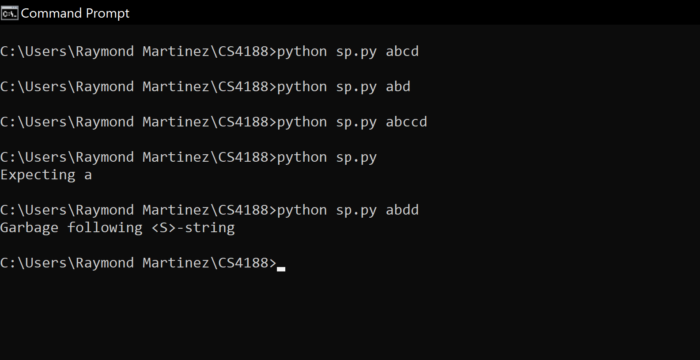

# Interpreters
These parsers follow different production rules, checking the input's validity.

## sp.py
This parser follows these grammar rules:
```
Grammar:
   <S> -> <A><C>
   <A> -> 'a''b'
   <C> -> 'c'<C>
   <C> -> 'd'

```
<br>
Screenshot results from my command prompt:



## p1.py
This parser checks if the input is a proper print statement similar to the Python interpreter.

<br>
Screenshot results from my command prompt:


## parser2.py
This parser sollows these grammar rules:
```
Grammar:
<S> -> 'a' ( B | C ) 'd'          { 'a' }
<B> -> b                          { 'b' }
<C> -> c*                         { 'c' , 'd' }
```
<br>
Screenshot results from my command prompt:


